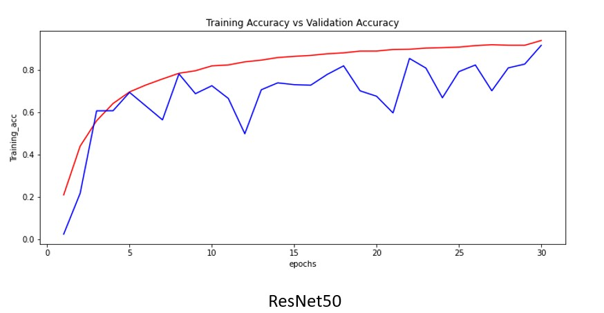
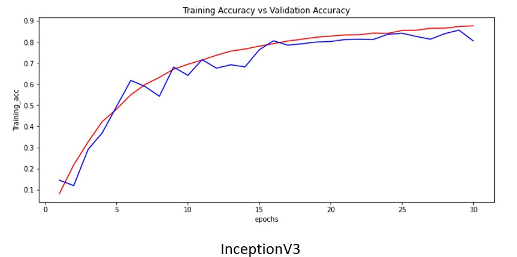
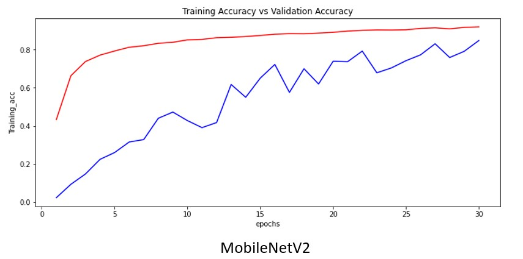

# Satellite-Image-Classification

## Introduction

The main purpose of this repository is to compare pre-trained neuronal networks from Keras in the classification of satellite images. My objetive will be to show in a graphical way that not all Deep Learning models work in different situations. Therefore, before sell a project we should test different architectures in order to obtain the best project possible.

## Data source

The dataset used was collected from pictures that one satellite has done.

## Data description

This dataset contains 24657 images stored in 45 folders in the training path and 3080 images without storing in the test path. Each folder represents one different class or one different type of picture.

## Problem goals

Goals are the following:

- Build a good model who classifies the images in their different types.
- Compare pre-trained neuronal networks from Keras.

## Conclusion

5 different pre-trained neuronal networks from Keras (ResNet50,VGG19,ResNet101,InceptionV3,MobileNetV2) were tested, and I have achieved different results with an important discussion:

- *ResNet50:* I have achieved the best training accuracy with **93.4%** in training set and **91,6%** in validation set.

- *VGG19:* I have achieved the worst training accuracy with **2.25%** in training set and **2.33%** in validation set.

- *ResNet101:* I have achieved **87.6%** accuracy in training set and **74.3%** in validation set.

- *InceptionV3:* I have achieved **88.1%** accuracy in training set and **80.5%** in validation set.

- *MobileNetV2:* I have achieved **92%** accuracy in training set and **84.8%** in validation set.

The discussion is related to the choice of what model can be the best for solving this problem. It is of the utmost importance not just focus on the results above exposed. All the training was done it in Colab with 30 epochs and it wasn't enough to determine what model is the most optimal.

- The first model has a very high accuracy but the learning wasn't stable, sometimes the validation accuracy dropped very much.

- The fourth model hasn't the best accuracy but it has the lowest accuracy gap between training and validation. So, it's very consistent.

- The last model started with a huge gap between training and validation but, with each step it was getting an increasing stable learning.

In a nutshell, it would be neccesary to do a longer training to check if the first and the last model could get a stable low gap between training accuracy and validation accuracy. As regards to the fourth model, from my point of view, basing on the results it is the best model due to the fact that it has a good consistence between train and validation and I think this is of the utmost importance when a project is sold.

